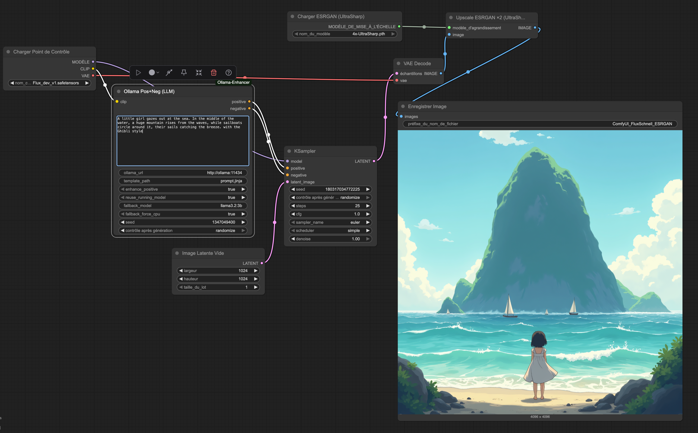

# ComfyUI-Ollama-Enhancer 🚀

Custom [ComfyUI](https://github.com/comfyanonymous/ComfyUI) nodes powered by [Ollama](https://ollama.ai)  
to automatically **generate and refine positive/negative prompts** for diffusion models like **Stable Diffusion XL** and **Flux**.

---

## ✨ Features

- 🔹 Automatic **positive & negative prompt generation** via Ollama  
- 🔹 Compatible with **Stable Diffusion XL** and **Flux** models  
- 🔹 Connects to **local or remote Ollama endpoints** (`http://localhost:11434` or your server)  
- 🔹 Produces ready-to-use **encoded outputs** for seamless workflow integration  
- 🔹 Optional **CPU mode** to save VRAM  
- 🔹 Simple, plug-and-play integration with existing ComfyUI pipelines  

---

## 🎨 Workflow example in ComfyUI


---

## 📦 Installation for Comfyui

Clone this repo inside your ComfyUI `custom_nodes` folder:

```bash
# Step 1 – go to the folder where you keep custom nodes for ComfyUI
cd ComfyUI/custom_nodes

# Step 2 – clone your copy of the Ollama‑Enhancer node from GitHub
git clone https://github.com/<your-username>/ComfyUI-Ollama-Enhancer.git

# Step 3 – change into the newly‑cloned repository
cd ComfyUI-Ollama-Enhancer

# Step 4 – install the Python dependencies listed in requirements.txt
# (the file is automatically generated by uv, but we keep it for compatibility)
pip install -r requirements.txt
```

## 📦 Installation for local dev

```bash
mise trust .mise.toml
mise run setup-dev 
mise run test
```
